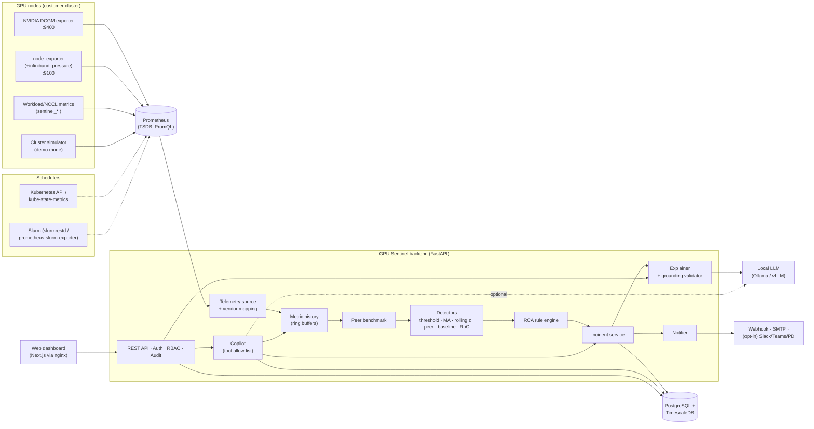
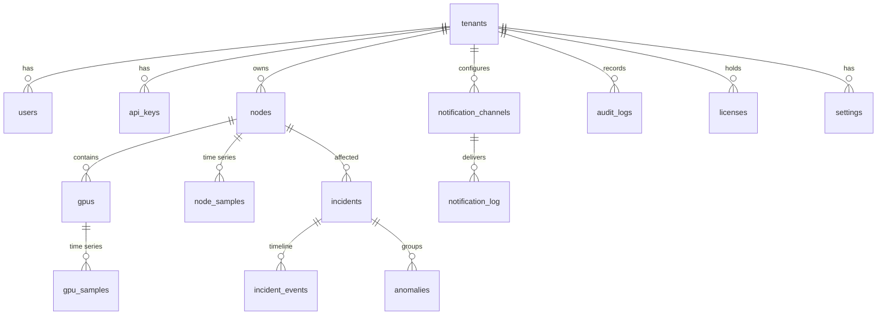
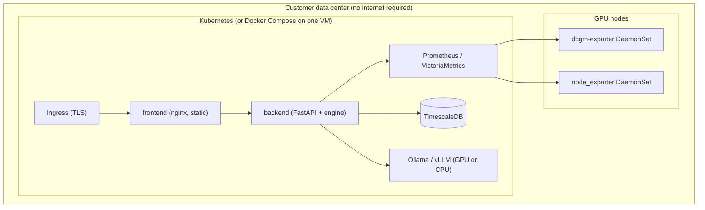

# GPU Sentinel AI — Architecture & Product Design

> **Detect → Correlate → Diagnose → Explain → Recommend** for NVIDIA GPU clusters,
> AI infrastructure and HPC — deployable fully on-premise, with no mandatory external service.

This document holds the 15 design deliverables. The code in this repository implements
the MVP described here. Sections marked **(implemented)** are in the code and covered by tests.
Sections marked **(designed)** are the planned architecture.

| # | Deliverable | Section |
|---|---|---|
| 1 | Complete architecture | [§1](#1-architecture) |
| 2 | Component diagram | [§2](#2-component-diagram) |
| 3 | Data-flow diagram | [§3](#3-data-flow) |
| 4 | Database schema | [§4](#4-database-schema) |
| 5 | API specification | [§5](#5-api-specification) |
| 6 | Repository structure | [§6](#6-repository-structure) |
| 7 | Technology selection | [§7](#7-technology-selection) |
| 8 | Security model | [§8](#8-security-model) |
| 9 | Deployment architecture | [§9](#9-deployment-architecture) |
| 10 | MVP feature list | [§10](#10-mvp-feature-list) |
| 11 | Phase-by-phase plan | [§11](#11-development-phases) |
| 12 | Testing strategy | [§12](#12-testing-strategy) |
| 13 | Demo strategy | [§13](#13-demo-strategy-gitex) |
| 14 | Commercialization | [§14](#14-commercialization) |
| 15 | Future roadmap | [§15](#15-roadmap) |

---

## 1. Architecture

### Design principles

1. **Deterministic first, AI second.** Telemetry is collected and analysed by statistical
   and rule-based code. The LLM never detects anomalies and never produces metrics. It only
   *explains* evidence the engine already produced, and a validator rejects any output
   containing numbers or causes that are not in that evidence.
2. **Evidence is preserved end to end.** Every incident carries its raw signals, peer
   statistics, rule matches (supporting *and* contradicting evidence) and a confidence
   score. Findings are labelled OBSERVED, INFERRED or RECOMMENDED.
3. **Compare against peers, not only thresholds.** Most performance problems (a GPU 14% slower
   than its siblings) never cross a static threshold. Robust peer benchmarking is the main
   detection signal.
4. **On-prem by default.** Local database, local metrics, local (optional) LLM. Cloud LLMs and
   SaaS notification targets are refused unless the customer explicitly enables them.
5. **Lightweight on production nodes.** The platform adds no agent of its own on GPU nodes in
   the MVP. It reuses DCGM exporter and node_exporter, which most sites already run, and
   scrape intervals are configurable.
6. **Vendor-neutral core.** Analytics only see *canonical* metric names. NVIDIA-specific
   field names live in one mapping (`telemetry/vendors.py`), so AMD (ROCm/amd-smi exporter)
   and Intel (XPU Manager) support means adding one mapping.

### Logical layers

| Layer | Responsibility | Implementation |
|---|---|---|
| 1. Data collection | GPU (DCGM), CPU/OS/network (node_exporter), InfiniBand, NCCL/workload agent, scheduler inventory | DCGM exporter, node_exporter, Sentinel workload metrics (`sentinel_*`), simulator (`simulator/`) |
| 2. Metrics transport | Scrape, short-term storage, PromQL | Prometheus |
| 3. Telemetry normalization | PromQL → canonical `FleetSnapshot` (vendor mapping, derivations, e.g. `DRAM_ACTIVE × peak BW`) | `telemetry/sources.py`, `telemetry/vendors.py` |
| 4. Analytics | Ring-buffer history, peer benchmarking, 6 detector types | `analytics/` |
| 5. Correlation / RCA | Multi-metric rules → ranked hypotheses with evidence & confidence | `rca/engine.py` |
| 6. Incident management | De-duplication, persistence gating, escalation, recurrence, auto-resolve, workflow | `incidents/service.py` |
| 7. Storage | Inventory, incidents, anomalies, downsampled samples, audit | PostgreSQL + TimescaleDB (SQLite for dev) |
| 8. AI explanation | Evidence packet → local LLM → grounding validator → explanation, with a deterministic fallback | `ai/` |
| 9. Operator Copilot | NL question → allow-listed read-only tools → grounded answer | `copilot/` |
| 10. API | REST, JWT/API-key auth, RBAC, audit | FastAPI (`api/`) |
| 11. Presentation | 14-page enterprise dashboard | Next.js static export behind nginx |
| 12. Notifications | Dashboard, webhook, email; Slack/Teams/PagerDuty adapters | `notifications/` |

---

## 2. Component diagram



---

## 3. Data flow

```mermaid
sequenceDiagram
  participant Exp as DCGM / node_exporter / simulator
  participant P as Prometheus
  participant E as Analysis engine (every N s)
  participant D as DB (Timescale)
  participant L as Local LLM
  participant U as Dashboard / Copilot
  Exp->>P: scrape /metrics (5–15 s)
  E->>P: ~45 instant PromQL queries (parallel)
  P-->>E: vectors (per node / per GPU)
  E->>E: normalize → FleetSnapshot (canonical)
  E->>E: history.ingest → peer benchmark (median/MAD per group)
  E->>E: detectors → AnomalySignals (merged per entity+metric)
  E->>E: RCA per node → hypotheses (+evidence, confidence)
  E->>D: upsert inventory, anomalies, incidents (+events); samples every k cycles
  E->>L: evidence packet (only for new/changed incidents, async)
  L-->>E: JSON explanation → validator (numbers & causes grounded?) → store / fallback
  E->>U: notifications (dashboard, webhook, email)
  U->>E: REST (JWT / API key) · copilot questions → allow-listed tools
```

**Cycle cost (measured):** about 70 ms per cycle for 96 GPUs in the simulator source, including detectors and
RCA. Peer statistics are vectorised with numpy, history is O(1) ring buffers, and
long-window baselines are cached and refreshed every 30 cycles.

### Incident gating (noise control)

* A node must be *incident-worthy* for `incident_min_cycles` (default 2) consecutive cycles.
  Incident-worthy means a static-threshold breach, a matched RCA rule, or throughput ≥ 8% below peers.
* One active incident per node. New evidence updates it rather than creating new alerts. If the
  top hypothesis changes, the change is logged as a `diagnosis_changed` event.
* The incident auto-resolves after `incident_resolve_cycles` (default 6) quiet cycles.
* When a node gets a new incident in the same category within 30 days, its `recurrence_count` is incremented.
* Marking an incident `FALSE_POSITIVE` suppresses same-category incidents on that node for 1 h.

---

## 4. Database schema

SQLAlchemy models live in `backend/sentinel/db.py`. On PostgreSQL, the `*_samples` tables become
Timescale hypertables with compression (`segmentby node`).



| Table | Key columns | Notes |
|---|---|---|
| `tenants` | id, name, plan | Tenant separation; every row carries `tenant_id` |
| `users` | username, password_hash (PBKDF2-SHA256, 390k iter), role, is_active, last_login | roles: admin / operator / viewer |
| `api_keys` | name, prefix, key_hash (SHA-256), role, revoked, last_used | plaintext shown once |
| `nodes` / `gpus` | cluster, server_type, gpu_model, rack, driver, CUDA, status / uuid, index, vendor | inventory upserted every cycle |
| `gpu_samples` | (ts, tenant, node, gpu_index) PK, metrics JSONB | hypertable, downsampled (`persist_every_cycles`) |
| `node_samples` | (ts, tenant, node) PK, metrics JSONB | hypertable |
| `fleet_samples` | (ts, tenant) PK, rollup JSONB | cheap overview trends |
| `anomalies` | entity, metric, category, direction, severity, methods[], value, expected, deviation_pct, zscore, active, incident_id | first/last seen |
| `incidents` | id `INC-000123`, node, gpus[], workload_id, severity, status, category, title, summary, perf_deviation_pct, confidence(+label), observed, signals, peer_comparison, hypotheses, recommended_actions, ai_explanation, acknowledged_by/at, assigned_to, resolved_at, resolution, recurrence_count, related_incidents | the evidence-preserving incident object |
| `incident_events` | ts, actor, type (opened, escalated, diagnosis_changed, recurrence, status, comment, auto_resolved) | timeline |
| `audit_logs` | ts, actor, role, action, resource, method, path, status_code, ip, details | every state-changing API call + logins |
| `notification_channels` | type, config_encrypted (Fernet), min_severity, enabled | credentials encrypted at rest |
| `notification_log` | channel_type, incident_id, event, status (sent/failed/blocked), read | also backs dashboard alerts |
| `settings`, `licenses` | JSON value / signed license token + parsed limits | |

**Why JSON metric columns?** New metrics and vendors don't need schema migrations. At scale, Timescale
continuous aggregates (5-minute and 1-hour rollups) are materialised from these rows. See §15.

---

## 5. API specification

The OpenAPI spec is served at `/docs` and `/openapi.json`. All `/api/v1/*` endpoints require
`Authorization: Bearer <JWT>` or `X-API-Key`.

| Method & path | Role | Purpose |
|---|---|---|
| `POST /api/v1/auth/login` | – | JWT login (rate-limited: 10 failures / 5 min / IP) |
| `GET /api/v1/auth/me` | any | current principal |
| `GET /api/v1/overview` | viewer | KPIs, top problem nodes, active incidents, fleet trend |
| `GET /api/v1/clusters` | viewer | rack layout, per-GPU status, peer groups |
| `GET /api/v1/nodes` · `/nodes/{node}` | viewer | node list · full node detail incl. peer comparison, anomalies, hypotheses, incident history |
| `GET /api/v1/nodes/{node}/history?metrics=&gpu=&minutes=` | viewer | time series (memory for recent windows, DB for long ones) |
| `GET /api/v1/gpus` · `/gpus/{node}/{index}` | viewer | fleet GPU table · GPU detail with peer benchmarking |
| `GET /api/v1/peers?metric=&level=` | viewer | peer distribution: value, median, deviation, robust z, percentile per entity |
| `GET /api/v1/performance` | viewer | node throughput vs peers + GPU throughput proxy distribution |
| `GET /api/v1/network` | viewer | IB/Ethernet/NVLink/NCCL per node with flags |
| `GET /api/v1/workloads` · `/workloads/{job}` | viewer | job analysis: stragglers, baseline change, per-node table |
| `GET /api/v1/trends?minutes=&node=&metrics=` | viewer | downsampled history + incident markers |
| `GET /api/v1/anomalies?active=&node=&category=` | viewer | anomaly signals |
| `GET /api/v1/incidents?status=&severity=&node=` · `/incidents/{id}` | viewer | incidents (detail includes events) |
| `POST /api/v1/incidents/{id}/status` `{status, note}` | operator | workflow transitions (validated state machine) |
| `POST /api/v1/incidents/{id}/comments` | operator | comment |
| `POST /api/v1/incidents/{id}/explain?force=` | viewer | AI explanation (cached; `force` regenerates) |
| `GET /api/v1/rca/nodes` · `/rca/rules` | viewer | live diagnoses · rule catalogue |
| `POST /api/v1/copilot/ask` `{question, use_llm}` | viewer | copilot answer + tool trace |
| `GET /api/v1/alerts` · `POST /alerts/read` | viewer | dashboard alerts |
| `GET/POST/DELETE /api/v1/demo/faults`, `POST /demo/scenarios/{name}` | operator | fault injection (demo mode only) |
| `GET/POST/PATCH /api/v1/users` | admin | user management |
| `GET/POST/DELETE /api/v1/api-keys` | admin | API keys |
| `GET/POST/DELETE /api/v1/notification-channels`, `POST …/{id}/test`, `GET /notification-log` | admin | notifications |
| `GET /api/v1/settings` (viewer) · `PATCH /settings` (admin) · `POST /retention/run` (admin) | | runtime settings & retention |
| `GET /api/v1/audit-logs` | admin | audit trail |
| `GET /api/v1/license` · `POST /license` | viewer / admin | license status / install signed license |
| `GET /api/v1/system/info`, `/healthz`, `/readyz`, `/metrics` | | health & self-metrics |

**Outbound webhook payload** (`schema: gpu-sentinel.incident.v1`), signed with
`X-Sentinel-Signature: sha256=<HMAC(body)>`. Events are `opened`, `updated`, `escalated` and `resolved`.

---

## 6. Repository structure

```
gpu-sentinel/
├── backend/
│   ├── sentinel/
│   │   ├── app.py                 # FastAPI factory, lifespan, audit middleware
│   │   ├── config.py              # SENTINEL_* settings
│   │   ├── db.py                  # schema + Timescale setup
│   │   ├── engine.py              # analysis loop orchestrator
│   │   ├── telemetry/             # canonical model, metric catalog, vendor PromQL mapping, sources
│   │   ├── simulator/             # cluster physics, faults, Prometheus exporter, service
│   │   ├── analytics/             # history, peer benchmarking, detectors, workloads
│   │   ├── rca/                   # correlation rules & hypotheses
│   │   ├── incidents/             # lifecycle service
│   │   ├── ai/                    # LLM providers, explainer + grounding validator
│   │   ├── copilot/               # NL → tools
│   │   ├── auth/                  # hashing, JWT, API keys, RBAC, SecretBox
│   │   ├── notifications/         # webhook/email/slack/teams/pagerduty
│   │   ├── licensing/             # signed licenses, plans, soft enforcement
│   │   └── api/                   # routers: fleet, ops, admin
│   ├── tests/                     # 70+ unit/integration/e2e tests
│   ├── Dockerfile  requirements*.txt  pytest.ini
├── frontend/                      # Next.js 14 (static export) + nginx
│   ├── app/<page>/page.tsx        # 14 pages + login + detail pages
│   ├── components/                # Shell, charts (SVG), ui, hypotheses, markdown
│   └── lib/                       # api client, formatting
├── deploy/
│   ├── prometheus/prometheus.yml
│   └── k8s/                       # kustomize: deployments, services, ingress, network policies
├── docs/ (ARCHITECTURE.md, DEMO.md)
├── docker-compose.yml             # full on-prem stack
├── docker-compose.dev.yml         # single-container mode
└── Makefile
```

---

## 7. Technology selection

| Concern | Choice | Why | Alternatives considered |
|---|---|---|---|
| GPU telemetry | **NVIDIA DCGM exporter** | NVIDIA's supported path: profiling metrics (SM active, DRAM active, tensor pipe) that nvidia-smi lacks, with low overhead | nvidia-smi polling (heavier, fewer metrics); NVML direct (needs our own agent) |
| Host/network | **node_exporter** (+infiniband, pressure collectors) | ubiquitous, cheap, with IB counters and PSI | Telegraf, custom agent |
| Metrics transport | **Prometheus** | standard in GPU/K8s shops; PromQL does counter→rate; customers often have it already | VictoriaMetrics (drop-in, better at scale), OTel collector |
| Long-term store | **PostgreSQL + TimescaleDB** | one database for relational data (incidents, users, audit) *and* time series; compression; continuous aggregates; runs on-prem | ClickHouse (at >10k GPUs), InfluxDB |
| Backend | **Python 3.11, FastAPI, Pydantic v2, SQLAlchemy 2, numpy** | the analytics/ML ecosystem; async API; typed models; easy to add scikit-learn/PyTorch detectors later | Go (faster, weaker ML ecosystem) |
| Frontend | **Next.js 14 + TypeScript, static export, hand-rolled SVG charts** | no Node runtime in production; ~100 kB per page; no CDN or chart-library dependency (air-gap friendly) | Grafana plugin (conflicts with "not another Grafana"), React SPA with Vite |
| Local LLM | **Ollama** (default), or any OpenAI-compatible server (vLLM, llama.cpp, TGI) | one-command local inference; the customer chooses the model; GPU or CPU | cloud APIs (opt-in only) |
| Auth | JWT (HS256) + API keys, PBKDF2 hashing, Fernet secret encryption | no external IdP required on-prem; OIDC/SAML on the roadmap | Keycloak (roadmap) |
| Packaging | Docker, Compose, Kustomize manifests | trade-show laptop → production K8s with the same images | Helm chart (roadmap) |

---

## 8. Security model

| Control | Implementation |
|---|---|
| Authentication | JWT bearer tokens (configurable TTL, issuer-checked) or `X-API-Key`; login rate limiting per IP |
| Password storage | PBKDF2-HMAC-SHA256, 390k iterations, per-user salt, constant-time compare |
| API keys | random 256-bit, `gs_` prefix, only SHA-256 hash stored, revocable, `last_used` tracked, role-scoped |
| RBAC | `viewer` (read, copilot) < `operator` (+incident workflow, fault injection) < `admin` (+users, keys, notifications, settings, audit, license); enforced server-side per endpoint (`require(permission)`) |
| Tenant separation | `tenant_id` on every row; queries filter by the principal's tenant |
| Secrets at rest | notification credentials encrypted with Fernet (AES-128-CBC + HMAC); key from `SENTINEL_SECRET_KEY` (K8s Secret / Vault); redacted in API responses |
| Audit | every state-changing request (actor, role, path, status, IP) plus explicit semantic events (`user.create`, `apikey.revoke`, `license.install`, `auth.login_failed`…) |
| Transport & headers | TLS at the ingress; `X-Frame-Options: DENY`, `nosniff`, `no-referrer`, CSP on the dashboard, `Cache-Control: no-store` on the API |
| Network isolation | Compose: internal-only `telemetry` and `data` networks (DB reachable only from the backend). K8s: default-deny NetworkPolicies with explicit egress to Prometheus, DB, local LLM and DNS |
| Data egress | Cloud LLM endpoints are refused unless `SENTINEL_ALLOW_CLOUD_LLM=true` (endpoint IP classification). Slack/Teams/PagerDuty are blocked unless `SENTINEL_ALLOW_EXTERNAL_NOTIFICATIONS=true`. The Settings page shows whether any telemetry leaves the site |
| LLM safety | The LLM sees only an evidence packet (no credentials, no raw DB access); the copilot can only call allow-listed read-only Python functions (no shell/SQL/HTTP); outputs are number- and cause-grounded or discarded |
| Containers | non-root UID, read-only root FS (K8s), dropped capabilities, seccomp RuntimeDefault, restricted Pod Security |
| Retention | configurable per data class (samples, incidents, audit) with an automatic purge job and a manual trigger |
| Supply chain | pinned dependency versions; no CDN assets at runtime |

**Production hardening checklist:** set `SENTINEL_JWT_SECRET`, `SENTINEL_SECRET_KEY` and
`SENTINEL_BOOTSTRAP_ADMIN_PASSWORD`, disable demo mode, and terminate TLS. The Settings →
Security posture panel flags any of these still at defaults.

---

## 9. Deployment architecture



* **Trade-show / laptop:** `docker compose up` (simulator + Prometheus + Timescale + backend + nginx).
  Optional `--profile llm` adds Ollama.
* **Single VM on-prem:** the same compose file, pointing at the customer's Prometheus with the simulator removed.
* **Kubernetes:** `kubectl apply -k deploy/k8s` (backend single replica, frontend 2 replicas, NetworkPolicies).
* **Air-gapped:** mirror the images to an internal registry and pre-pull the LLM model, then set the `llm`
  network to `internal: true`. No step downloads anything at runtime.
* **Scaling plan:** the backend analysis engine is a singleton in the MVP (~70 ms per cycle for 96 GPUs, roughly
  linear). Beyond ~5,000 GPUs, shard the engine by cluster (one engine per peer-group partition), put
  API replicas behind the ingress with leader election for the engine, and use VictoriaMetrics for ingest.

---

## 10. MVP feature list

**Implemented in this repository**

- [x] Telemetry simulator: 12 × 8 H100 cluster, Slurm training job + K8s inference, 12 fault types, severity/duration, one-click scenarios, random-fault mode, thermal inertia
- [x] DCGM-compatible and node_exporter-compatible Prometheus exporter (real metric names and labels)
- [x] Prometheus collector (about 45 PromQL queries, counter→rate, DRAM-active→GB/s derivation, throttle bitmask decoding, fault-tolerant)
- [x] Canonical telemetry model and vendor mapping layer (ready for AMD/Intel)
- [x] GPU peer benchmarking: configurable grouping (model / server type / workload class / cluster / job), fallback for small groups, median/mean/p10/p90/MAD, robust z, percentile rank, deviation %, historical baseline
- [x] Detectors: static thresholds (on moving averages), rolling z-score, peer deviation, historical baseline, rate of change (time-windowed), plus merging into one signal per metric with every method recorded
- [x] RCA engine with 12 rules (thermal, power cap, clock misconfiguration, HBM degradation, ECC/XID, CPU bottleneck, host memory pressure, network degradation, NCCL bottleneck, NVLink, PCIe, software regression) and an "unexplained degradation" fallback
- [x] Incidents: evidence-preserving object, gating, dedup, escalation, recurrence, auto-resolve, workflow (OPEN / ACKNOWLEDGED / INVESTIGATING / RESOLVED / FALSE_POSITIVE), comments, timeline
- [x] AI explanations: deterministic template (offline) plus optional local LLM behind a grounding validator
- [x] Operator Copilot: 9 read-only tools with deterministic routing and optional LLM routing and phrasing
- [x] Notifications: dashboard alerts, HMAC-signed webhook, SMTP email, Slack/Teams/PagerDuty adapters (opt-in)
- [x] Security: JWT, API keys, RBAC, audit, encrypted credentials, rate limiting, retention, network isolation
- [x] License model: Ed25519-signed, offline-verifiable, soft enforcement
- [x] Dashboard: Overview, Cluster Health, GPU Fleet, Node Details, GPU Details, Performance, Anomalies, Incidents (+detail), RCA, Workloads, Network, Historical Trends, Ask Sentinel, Demo Control, Settings
- [x] Docker/Compose, Kubernetes manifests, CI

**Deliberately not in the MVP:** payment processing, SSO (OIDC/SAML), multi-cluster federation, ML detectors.
The interfaces for all of these exist.

---

## 11. Development phases

| Phase | Scope | Status | Exit criteria |
|---|---|---|---|
| 1 | Telemetry ingestion + dashboard | ✅ | simulator → Prometheus → backend → UI shows live fleet |
| 2 | GPU peer comparison | ✅ | per-metric deviation vs peer group visible for every GPU/node |
| 3 | Anomaly detection | ✅ | 0 false positives on a healthy fleet (tested over 3 seeds, 2 intervals); every fault type detected |
| 4 | Correlation & RCA | ✅ | correct top hypothesis for all 12 fault types (parametrised test) |
| 5 | Local LLM | ✅ | Ollama/OpenAI-compatible provider, grounding validator, offline fallback |
| 6 | Ask Sentinel | ✅ | the 8 example questions answered from real data |
| 7 | Kubernetes/Slurm integration | ◐ | workload model + job analysis via metrics labels ✅; native Slurm REST / K8s API adapters ⏳ |
| 8 | Auth / RBAC | ✅ | role matrix enforced and tested |
| 9 | Demo simulator | ✅ | scripted GITEX run in < 2 min per scenario |
| 10 | Production hardening | ◐ | security headers, non-root, NetworkPolicies ✅; HA engine, SSO, Helm, load tests ⏳ |

---

## 12. Testing strategy

| Level | What | Where |
|---|---|---|
| Unit | peer stats, ring buffer, each detector, signal merging, grounding checker, password/JWT/API-key/SecretBox, license signing | `tests/test_analytics.py`, `test_ai.py`, `test_security.py` |
| Scenario (golden) | inject each of the 12 faults → assert the top RCA hypothesis, evidence present, confidence bounds | `tests/test_rca.py` |
| False-positive budget | healthy fleet for 80 cycles × 3 seeds × 2 intervals → **zero** signals | `test_no_false_positives_on_healthy_fleet` |
| Collector contract | mocked Prometheus HTTP API → canonical snapshot (derivations, throttle decoding, failing queries) | `tests/test_prometheus_source.py` |
| Exporter contract | exposition text parses with the official Prometheus parser; DCGM names and labels present | `tests/test_simulator.py` |
| API end-to-end | inject → cycles → incident with evidence → explain → workflow → auto-resolve → recurrence; RBAC; audit; API keys | `tests/test_api_e2e.py` |
| Copilot | 11 routing cases plus content assertions for each example question | `tests/test_copilot.py` |
| Notifications | real HTTP server receives an HMAC-signed webhook when an incident opens | `tests/test_notifications.py` |
| Frontend | `tsc --noEmit` + `next build` in CI; Playwright screenshot smoke run (manual) | CI workflow |
| Live integration (manual/nightly) | real Prometheus binary scraping the simulator, backend in `prometheus` mode | see README "Verify the Prometheus path" |

**Future:** replay recorded DCGM traces from real incidents as golden tests; property-based tests on the detectors;
k6 load tests on the API; detector precision/recall benchmarks per fault severity.

---

## 13. Demo strategy (GITEX)

See [DEMO.md](DEMO.md) for the minute-by-minute script. In short:

1. **Healthy baseline** (Overview green, 96 GPUs, 0 incidents). Point out that nothing leaves the laptop.
2. **"Inject thermal problem into GPU-04"** from Demo Control. Within about 30–60 s the temperature ramps, clocks
   drop and throttle flags appear. One incident opens, not five alerts.
3. **Incident page:** "gpu-04 is performing ~17% below its peer baseline", with the OBSERVED / INFERRED / RECOMMENDED
   explanation and the peer comparison table (GPU utilization shown as *normal*).
4. **Copilot:** "Why is GPU-04 slow?", "Why did training job 78421 slow down?", "Compare node 4 with healthy nodes".
5. **Contrast case:** a software regression. Throughput drops but GPU telemetry is normal, so the engine says
   "investigate the application layer" with capped confidence. This shows it doesn't over-claim.
6. **Clear all** (simulate repair). The incident auto-resolves; replay → recurrence is detected.

Reliability measures: deterministic simulator physics, no network dependency, pre-built images,
a `mixed-incidents` one-click scenario, and a deterministic explainer if the LLM is slow or absent.

---

## 14. Commercialization

* **Packaging:** Community (≤16 GPUs; monitoring, peer benchmarking and detection), Professional (≤512 GPUs;
  + RCA, AI explanations, copilot, notifications), Enterprise (unlimited; + SSO, multi-tenant, audit export,
  priority support). Implemented as signed license documents (`licensing/license.py`).
* **Pricing models supported by the license schema:** per-GPU (primary; aligns with the value delivered),
  per-node, and enterprise site license, plus support tiers (standard / premium / mission-critical).
* **Offline licensing:** Ed25519-signed tokens are verified locally, so air-gapped sites work. Enforcement is
  *soft*: monitoring never stops on license expiry.
* **Multi-tenancy:** `tenant_id` everywhere enables a managed-service / GPU-cloud offering
  (one control plane, many customers). Tenant-scoped API keys are already in place.
* **Channels:** OEM/server vendors and system integrators (bundle with GPU cluster deliveries), GPU clouds
  (white-label), HPC centres and universities (academic pricing).
* **Differentiation:** Grafana and DCGM *show* metrics. GPU Sentinel *explains* them: peer benchmarking,
  multi-metric correlation, evidence-graded root cause and on-prem AI, with no telemetry leaving the site.
* **Not in the MVP:** payment processing, usage metering export, license server.

---

## 15. Roadmap

| Horizon | Items |
|---|---|
| Next (0–3 months) | Native Slurm (`slurmrestd`) and Kubernetes API adapters (job ↔ pod ↔ GPU mapping via dcgm-exporter pod labels); Helm chart; OIDC/SAML SSO; Timescale continuous aggregates; incident assignment and SLAs; Grafana deep links |
| Mid (3–9 months) | ML detectors behind the `Detector` interface: Isolation Forest on per-GPU feature vectors, learned peer baselines, forecasting residuals, clustering of incident signatures; NCCL profiler plugin integration (per-collective timing); XID/`dmesg` log ingestion; `dcgmi diag` orchestration (operator-approved, maintenance-window aware) |
| Long (9–18 months) | AMD (ROCm/amd-smi exporter) and Intel (XPU Manager) vendor mappings; multi-cluster federation; HA engine with sharding; fleet-level capacity and energy-efficiency analytics (perf/W vs peers); RAG over runbooks with local embeddings; closed-loop remediation (drain / reboot) with approvals |
