# vLLM on DGX Spark (GB10): before / after

> **SIMULATED RESULTS - NOT GB10 MEASUREMENTS.** Produced by the analytical GB10 simulator (`servebench.mock`) to validate the harness end-to-end. They show the *direction* of each knob, not real numbers. Agent `task success` is meaningless here (the simulator does not reason). Real results live in `results/gb10/` after running on the device.

Baseline: **`00_baseline`**. Each other experiment changes one or two knobs relative to it.

| experiment | what changed | server startup s |
|---|---|---:|
| `00_baseline` | BF16 weights, BF16 KV, prefix caching OFF, 2k-token step budget, 32k context | 0.2 |
| `01_prefix_caching` | --enable-prefix-caching | 0.1 |
| `02_fp8_quant` | model Qwen/Qwen3-8B -> Qwen/Qwen3-8B-FP8; --kv-cache-dtype fp8 | 0.2 |
| `03_batching` | --max-num-batched-tokens 2048 -> 8192; --max-num-seqs 128 -> 256 | 0.1 |
| `04_context_limit` | --max-model-len 32768 -> 8192 | 0.2 |
| `05_combined` | --enable-prefix-caching; model Qwen/Qwen3-8B-FP8 + --kv-cache-dtype fp8; --max-num-batched-tokens 8192 | 0.2 |

## Workload `chat`

Headline at concurrency = **64** (deltas vs `00_baseline`):

| metric | `00_baseline` | `01_prefix_caching` | `02_fp8_quant` | `03_batching` | `04_context_limit` | `05_combined` |
|---|---:|---:|---:|---:|---:|---:|
| output tok/s | 311.7 | 302.1 (-3% worse) | 604.5 (+94% better) | 312.1 (=) | 311.1 (=) | 576.4 (+85% better) |
| TTFT p50 ms | 6,298 | 6,461 (+3% worse) | 3,187 (-49% better) | 6,287 (=) | 6,319 (=) | 3,242 (-49% better) |
| TTFT p99 ms | 12,223 | 12,412 (+2% worse) | 6,163 (-50% better) | 12,032 (-2% better) | 12,235 (=) | 6,143 (-50% better) |
| TPOT p50 ms | 151.4 | 156.6 (+3% worse) | 78.4 (-48% better) | 155.6 (+3% worse) | 151.6 (=) | 85.5 (-44% better) |
| E2E p99 ms | 26,252 | 27,096 (+3% worse) | 13,532 (-48% better) | 26,222 (=) | 26,288 (=) | 14,194 (-46% better) |
| goodput req/s | 0.00 | 0.00 | 1.25 | 0.00 | 0.00 | 1.20 |
| errors | 0.000 | 0.000 | 0.000 | 0.000 | 0.000 | 0.000 |
| peak KV usage | 0.10 | 0.10 (=) | 0.04 (-56% better) | 0.10 (+1% worse) | 0.10 (=) | 0.04 (-56% better) |
| preemptions | 0 | 0 | 0 | 0 | 0 | 0 |
| prefix hit rate | 0.00 | 0.00 | 0.00 | 0.00 | 0.00 | 0.00 |

All levels

| experiment | level | out tok/s | TTFT p50 | TTFT p99 | TPOT p50 | goodput | peak KV | preempt |
|---|---:|---:|---:|---:|---:|---:|---:|---:|
| `00_baseline` | 1 | 11.6 | 207 | 248 | 85.3 | 0.09 | 0.00 | 0 |
| `00_baseline` | 4 | 43.4 | 737 | 880 | 86.8 | 0.34 | 0.01 | 0 |
| `00_baseline` | 16 | 141.4 | 1,393 | 3,049 | 101.5 | 0.86 | 0.02 | 0 |
| `00_baseline` | 64 | 311.7 | 6,298 | 12,223 | 151.4 | 0.00 | 0.10 | 0 |
| `01_prefix_caching` | 1 | 11.6 | 208 | 248 | 85.3 | 0.09 | 0.00 | 0 |
| `01_prefix_caching` | 4 | 43.4 | 740 | 885 | 87.0 | 0.34 | 0.01 | 0 |
| `01_prefix_caching` | 16 | 140.2 | 1,290 | 3,070 | 102.4 | 0.82 | 0.02 | 0 |
| `01_prefix_caching` | 64 | 302.1 | 6,461 | 12,412 | 156.6 | 0.00 | 0.10 | 0 |
| `02_fp8_quant` | 1 | 21.9 | 107 | 128 | 45.1 | 0.17 | 0.00 | 0 |
| `02_fp8_quant` | 4 | 82.1 | 372 | 445 | 46.0 | 0.64 | 0.00 | 0 |
| `02_fp8_quant` | 16 | 269.9 | 643 | 1,540 | 53.6 | 2.11 | 0.01 | 0 |
| `02_fp8_quant` | 64 | 604.5 | 3,187 | 6,163 | 78.4 | 1.25 | 0.04 | 0 |
| `03_batching` | 1 | 11.6 | 207 | 246 | 85.3 | 0.09 | 0.00 | 0 |
| `03_batching` | 4 | 43.4 | 737 | 880 | 86.9 | 0.34 | 0.01 | 0 |
| `03_batching` | 16 | 140.3 | 2,881 | 3,031 | 91.7 | 0.07 | 0.02 | 0 |
| `03_batching` | 64 | 312.1 | 6,287 | 12,032 | 155.6 | 0.00 | 0.10 | 0 |
| `04_context_limit` | 1 | 11.6 | 207 | 247 | 85.3 | 0.09 | 0.00 | 0 |
| `04_context_limit` | 4 | 43.4 | 738 | 880 | 87.0 | 0.34 | 0.01 | 0 |
| `04_context_limit` | 16 | 141.3 | 1,277 | 3,051 | 101.6 | 0.83 | 0.02 | 0 |
| `04_context_limit` | 64 | 311.1 | 6,319 | 12,235 | 151.6 | 0.00 | 0.10 | 0 |
| `05_combined` | 1 | 21.9 | 108 | 133 | 45.2 | 0.17 | 0.00 | 0 |
| `05_combined` | 4 | 81.9 | 374 | 447 | 46.2 | 0.64 | 0.00 | 0 |
| `05_combined` | 16 | 263.8 | 1,456 | 1,552 | 49.4 | 2.06 | 0.01 | 0 |
| `05_combined` | 64 | 576.4 | 3,242 | 6,143 | 85.5 | 1.20 | 0.04 | 0 |

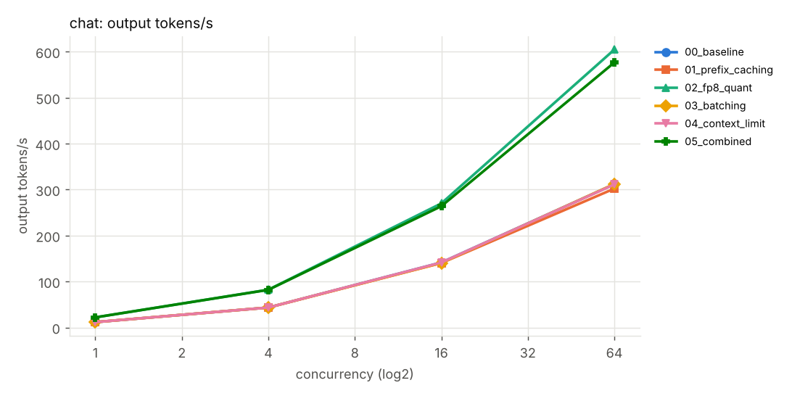
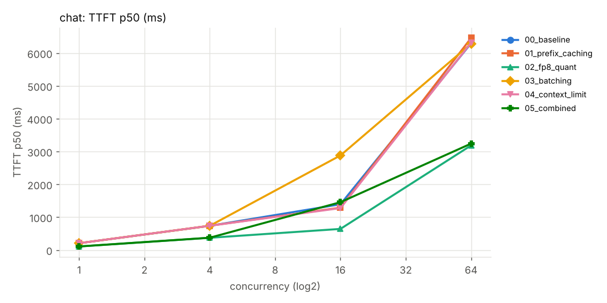
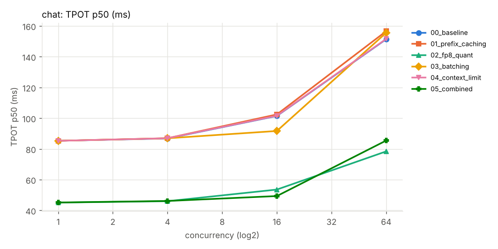

## Workload `rag_shared_prefix`

Headline at concurrency = **32** (deltas vs `00_baseline`):

| metric | `00_baseline` | `01_prefix_caching` | `02_fp8_quant` | `03_batching` | `04_context_limit` | `05_combined` |
|---|---:|---:|---:|---:|---:|---:|
| output tok/s | 92.8 | 207.0 (+123% better) | 181.8 (+96% better) | 91.5 (-1% worse) | 92.8 (=) | 388.5 (+319% better) |
| TTFT p50 ms | 14,801 | 1,857 (-87% better) | 7,459 (-50% better) | 16,938 (+14% worse) | 14,804 (=) | 1,014 (-93% better) |
| TTFT p99 ms | 27,421 | 2,009 (-93% better) | 13,813 (-50% better) | 27,536 (=) | 27,417 (=) | 1,016 (-96% better) |
| TPOT p50 ms | 218.1 | 140.4 (-36% better) | 111.9 (-49% better) | 216.0 (-1% better) | 218.0 (=) | 74.9 (-66% better) |
| E2E p99 ms | 44,104 | 19,769 (-55% better) | 22,504 (-49% better) | 44,753 (+1% worse) | 44,088 (=) | 10,533 (-76% better) |
| goodput req/s | 0.00 | 1.42 | 0.00 | 0.00 | 0.00 | 3.04 |
| errors | 0.000 | 0.000 | 0.000 | 0.000 | 0.000 | 0.000 |
| peak KV usage | 0.18 | 0.04 (-77% better) | 0.08 (-56% better) | 0.18 (+1% worse) | 0.18 (=) | 0.02 (-90% better) |
| preemptions | 0 | 0 | 0 | 0 | 0 | 0 |
| prefix hit rate | 0.00 | 0.94 | 0.00 | 0.00 | 0.00 | 0.94 |

All levels

| experiment | level | out tok/s | TTFT p50 | TTFT p99 | TPOT p50 | goodput | peak KV | preempt |
|---|---:|---:|---:|---:|---:|---:|---:|---:|
| `00_baseline` | 1 | 10.7 | 896 | 899 | 86.8 | 0.08 | 0.01 | 0 |
| `00_baseline` | 8 | 54.3 | 2,388 | 6,704 | 128.6 | 0.05 | 0.04 | 0 |
| `00_baseline` | 32 | 92.8 | 14,801 | 27,421 | 218.1 | 0.00 | 0.18 | 0 |
| `01_prefix_caching` | 1 | 11.4 | 93 | 902 | 87.0 | 0.09 | 0.01 | 0 |
| `01_prefix_caching` | 8 | 78.4 | 494 | 518 | 99.0 | 0.61 | 0.03 | 0 |
| `01_prefix_caching` | 32 | 207.0 | 1,857 | 2,009 | 140.4 | 1.42 | 0.04 | 0 |
| `02_fp8_quant` | 1 | 20.4 | 455 | 459 | 45.9 | 0.16 | 0.00 | 0 |
| `02_fp8_quant` | 8 | 105.0 | 1,200 | 3,385 | 66.8 | 0.69 | 0.02 | 0 |
| `02_fp8_quant` | 32 | 181.8 | 7,459 | 13,813 | 111.9 | 0.00 | 0.08 | 0 |
| `03_batching` | 1 | 10.8 | 868 | 878 | 86.8 | 0.08 | 0.01 | 0 |
| `03_batching` | 8 | 53.2 | 4,087 | 6,893 | 119.4 | 0.05 | 0.04 | 0 |
| `03_batching` | 32 | 91.5 | 16,938 | 27,536 | 216.0 | 0.00 | 0.18 | 0 |
| `04_context_limit` | 1 | 10.7 | 896 | 899 | 86.8 | 0.08 | 0.01 | 0 |
| `04_context_limit` | 8 | 54.3 | 2,388 | 6,706 | 128.6 | 0.05 | 0.04 | 0 |
| `04_context_limit` | 32 | 92.8 | 14,804 | 27,417 | 218.0 | 0.00 | 0.18 | 0 |
| `05_combined` | 1 | 21.6 | 53 | 443 | 46.0 | 0.17 | 0.00 | 0 |
| `05_combined` | 8 | 147.9 | 262 | 293 | 52.4 | 1.16 | 0.01 | 0 |
| `05_combined` | 32 | 388.5 | 1,014 | 1,016 | 74.9 | 3.04 | 0.02 | 0 |

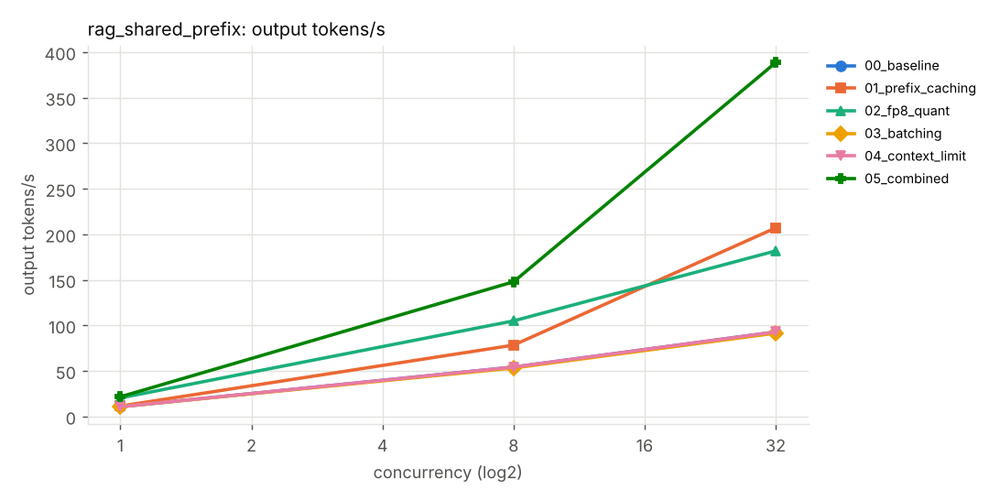
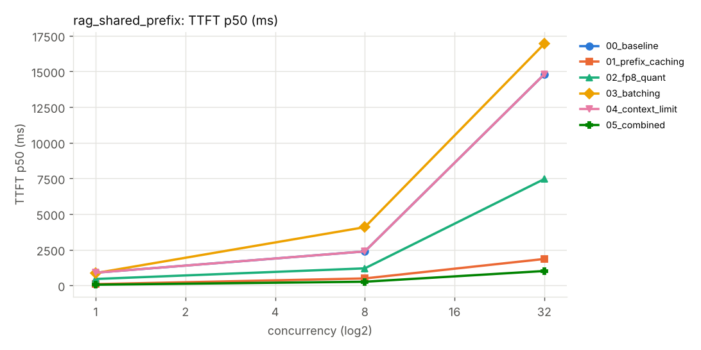
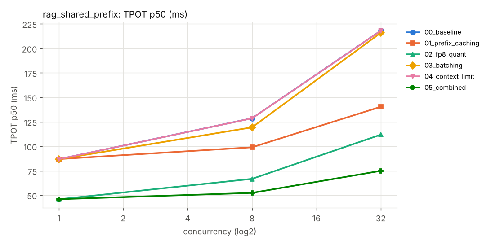

## Workload `long_context`

Headline at concurrency = **8** (deltas vs `00_baseline`):

| metric | `00_baseline` | `01_prefix_caching` | `02_fp8_quant` | `03_batching` | `04_context_limit` | `05_combined` |
|---|---:|---:|---:|---:|---:|---:|
| output tok/s | 10.2 | 10.1 (-1% worse) | 20.3 (+98% better) | 9.2 (-10% worse) | 0.0 (-100% worse) | 17.8 (+73% better) |
| TTFT p50 ms | 7,018 | 7,078 (+1% worse) | 3,527 (-50% better) | 11,694 (+67% worse) | - | 5,958 (-15% better) |
| TTFT p99 ms | 43,329 | 43,618 (+1% worse) | 21,795 (-50% better) | 46,147 (+7% worse) | - | 23,367 (-46% better) |
| TPOT p50 ms | 640.6 | 648.7 (+1% worse) | 322.9 (-50% better) | 678.5 (+6% worse) | - | 353.6 (-45% better) |
| E2E p99 ms | 83,577 | 84,389 (+1% worse) | 42,085 (-50% better) | 89,436 (+7% worse) | - | 45,945 (-45% better) |
| goodput req/s | 0.00 | 0.00 | 0.00 | 0.00 | 0.00 | 0.00 |
| errors | 0.000 | 0.000 | 0.000 | 0.000 | 1.000 | 0.000 |
| peak KV usage | 0.23 | 0.23 (=) | 0.10 (-56% better) | 0.23 (=) | 0.00 (-100% better) | 0.10 (-56% better) |
| preemptions | 0 | 0 | 0 | 0 | 0 | 0 |
| prefix hit rate | 0.00 | 0.00 | 0.00 | 0.00 | - | 0.00 |

All levels

| experiment | level | out tok/s | TTFT p50 | TTFT p99 | TPOT p50 | goodput | peak KV | preempt |
|---|---:|---:|---:|---:|---:|---:|---:|---:|
| `00_baseline` | 1 | 5.6 | 5,512 | 5,518 | 93.9 | 0.00 | 0.03 | 0 |
| `00_baseline` | 4 | 9.2 | 6,444 | 21,236 | 334.7 | 0.00 | 0.12 | 0 |
| `00_baseline` | 8 | 10.2 | 7,018 | 43,329 | 640.6 | 0.00 | 0.23 | 0 |
| `01_prefix_caching` | 1 | 5.6 | 5,523 | 5,531 | 94.2 | 0.00 | 0.03 | 0 |
| `01_prefix_caching` | 4 | 9.1 | 6,498 | 21,344 | 338.4 | 0.00 | 0.12 | 0 |
| `01_prefix_caching` | 8 | 10.1 | 7,078 | 43,618 | 648.7 | 0.00 | 0.23 | 0 |
| `02_fp8_quant` | 1 | 10.9 | 2,774 | 2,787 | 49.4 | 0.00 | 0.01 | 0 |
| `02_fp8_quant` | 4 | 18.1 | 3,240 | 10,681 | 169.8 | 0.00 | 0.05 | 0 |
| `02_fp8_quant` | 8 | 20.3 | 3,527 | 21,795 | 322.9 | 0.00 | 0.10 | 0 |
| `03_batching` | 1 | 5.4 | 5,868 | 5,875 | 93.9 | 0.00 | 0.03 | 0 |
| `03_batching` | 4 | 8.4 | 11,689 | 22,796 | 299.5 | 0.00 | 0.12 | 0 |
| `03_batching` | 8 | 9.2 | 11,694 | 46,147 | 678.5 | 0.00 | 0.23 | 0 |
| `04_context_limit` | 1 | 0.0 | - | - | - | 0.00 | 0.00 | 0 |
| `04_context_limit` | 4 | 0.0 | - | - | - | 0.00 | 0.00 | 0 |
| `04_context_limit` | 8 | 0.0 | - | - | - | 0.00 | 0.00 | 0 |
| `05_combined` | 1 | 10.5 | 2,953 | 2,963 | 49.8 | 0.00 | 0.01 | 0 |
| `05_combined` | 4 | 16.2 | 5,890 | 11,507 | 156.0 | 0.00 | 0.05 | 0 |
| `05_combined` | 8 | 17.8 | 5,958 | 23,367 | 353.6 | 0.00 | 0.10 | 0 |

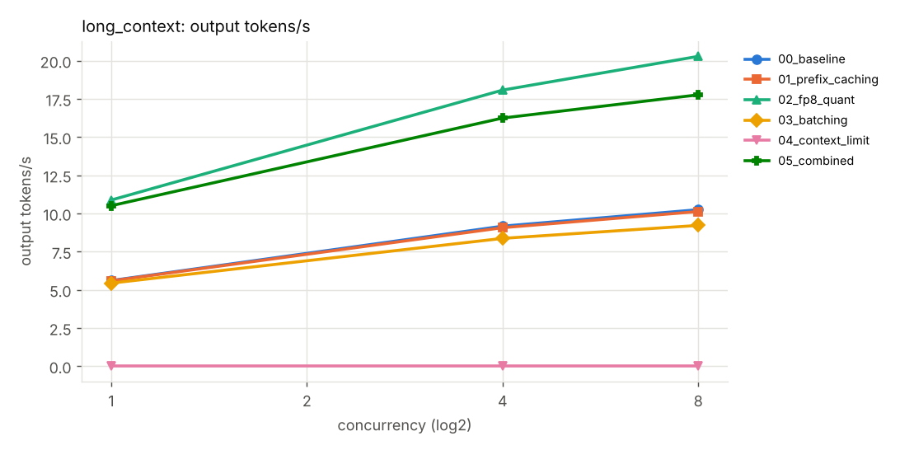
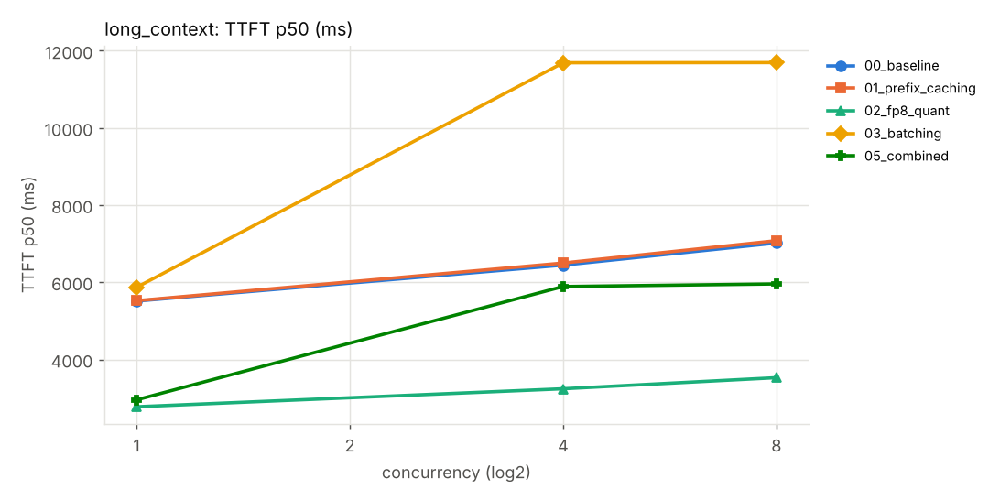
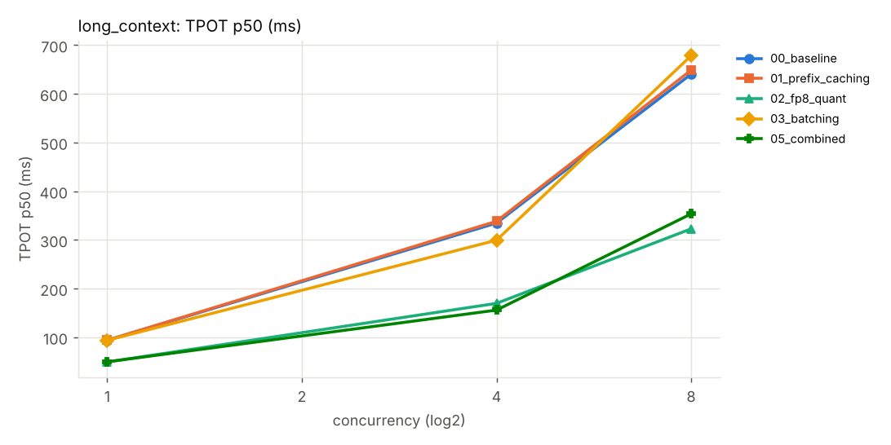

## Agent loop

Multi-step tool-using agent; each step's prompt = previous prompt + output + tool result. `replay` mode has a fixed shape so latency is comparable across configs; `react` mode uses real tool calls and also reports task success.

### `react` - 4 concurrent session(s)

| metric | `00_baseline` | `01_prefix_caching` | `02_fp8_quant` | `03_batching` | `04_context_limit` | `05_combined` |
|---|---:|---:|---:|---:|---:|---:|
| task p50 ms | 16,052 | 7,609 (-53% better) | 8,379 (-48% better) | 16,029 (=) | 16,046 (=) | 4,754 (-70% better) |
| task p90 ms | 21,144 | 9,854 (-53% better) | 10,919 (-48% better) | 21,180 (=) | 21,135 (=) | 6,133 (-71% better) |
| episodes/min | 15.2 | 31.9 (+111% better) | 29.2 (+93% better) | 15.2 (=) | 15.2 (=) | 51.6 (+241% better) |
| TTFT share of LLM time | 0.24 | 0.09 (-61%) | 0.28 (+15%) | 0.26 (+8%) | 0.24 (=) | 0.12 (-49%) |
| prefix hit rate | 0.00 | 0.97 | 0.00 | 0.00 | 0.00 | 0.97 |
| task success | 0.00 | 0.00 | 0.00 | 0.00 | 0.00 | 0.00 |

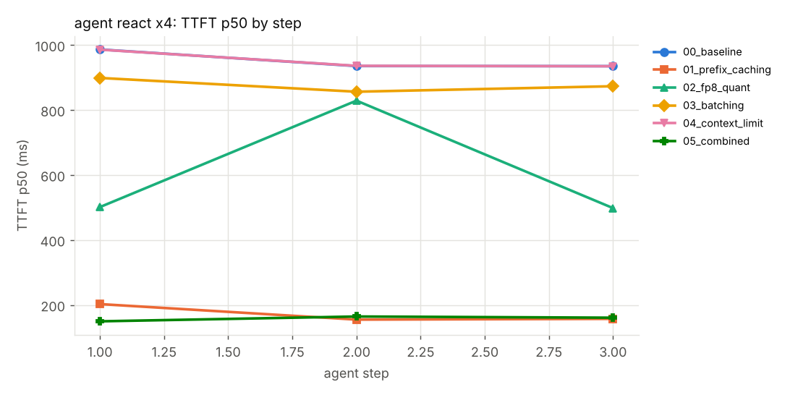

### `replay` - 1 concurrent session(s)

| metric | `00_baseline` | `01_prefix_caching` | `02_fp8_quant` | `03_batching` | `04_context_limit` | `05_combined` |
|---|---:|---:|---:|---:|---:|---:|
| task p50 ms | 45,634 | 40,073 (-12% better) | 23,944 (-48% better) | 45,744 (=) | 45,602 (=) | 21,709 (-52% better) |
| task p90 ms | 45,641 | 40,484 (-11% better) | 24,015 (-47% better) | 45,754 (=) | 45,639 (=) | 21,949 (-52% better) |
| episodes/min | 1.3 | 1.5 (+14% better) | 2.5 (+91% better) | 1.3 (=) | 1.3 (+1% better) | 2.8 (+111% better) |
| TTFT share of LLM time | 0.15 | 0.03 (-81%) | 0.15 (-3%) | 0.15 (+2%) | 0.15 (=) | 0.04 (-77%) |
| prefix hit rate | 0.00 | 0.87 | 0.00 | 0.00 | 0.00 | 0.87 |
| task success | - | - | - | - | - | - |

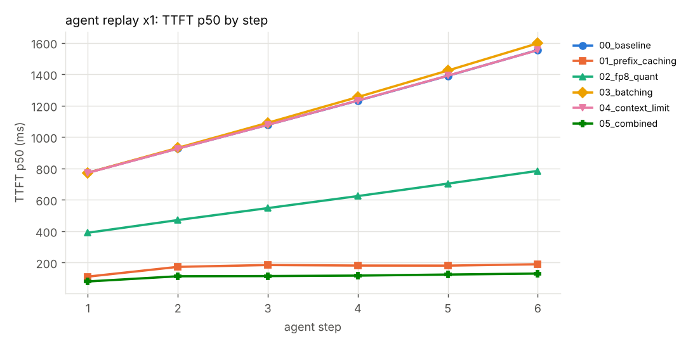

### `replay` - 8 concurrent session(s)

| metric | `00_baseline` | `01_prefix_caching` | `02_fp8_quant` | `03_batching` | `04_context_limit` | `05_combined` |
|---|---:|---:|---:|---:|---:|---:|
| task p50 ms | 93,782 | 54,940 (-41% better) | 48,071 (-49% better) | 99,944 (+7% worse) | 93,783 (=) | 33,531 (-64% better) |
| task p90 ms | 99,152 | 55,019 (-45% better) | 50,791 (-49% better) | 102,091 (+3% worse) | 99,140 (=) | 33,963 (-66% better) |
| episodes/min | 5.1 | 8.7 (+72% better) | 9.9 (+95% better) | 4.8 (-6% worse) | 5.1 (=) | 14.3 (+182% better) |
| TTFT share of LLM time | 0.13 | 0.10 (-24%) | 0.12 (-2%) | 0.26 (+103%) | 0.13 (=) | 0.13 (+2%) |
| prefix hit rate | 0.00 | 0.89 | 0.00 | 0.00 | 0.00 | 0.89 |
| task success | - | - | - | - | - | - |

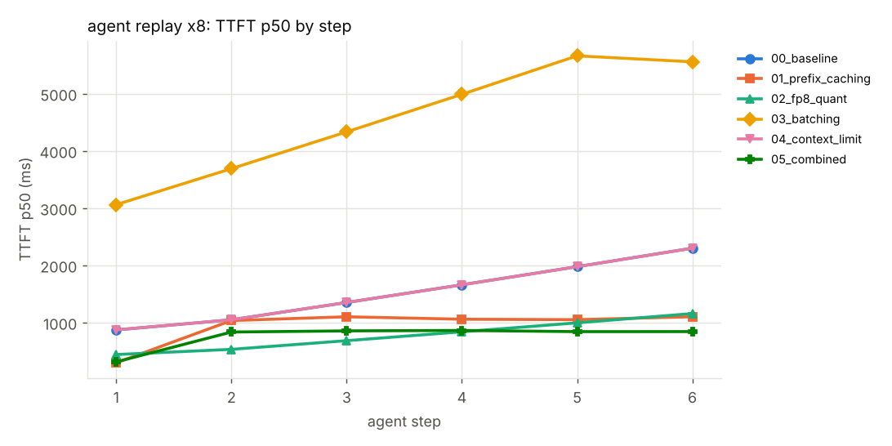

## Profiles

Open the `.json.gz` traces in https://ui.perfetto.dev (drag & drop).

| experiment | trace | GPU busy frac | top categories |
|---|---|---:|---|
| `00_baseline` | [simulated_rank0.1791288174.pt.trace.json.gz](00_baseline/profile/traces/simulated_rank0.1791288174.pt.trace.json.gz) | 0.96 | gemm 89%, attention 6%, norm_act 3% |
| `01_prefix_caching` | [simulated_rank0.1791287918.pt.trace.json.gz](01_prefix_caching/profile/traces/simulated_rank0.1791287918.pt.trace.json.gz) | 0.96 | gemm 89%, attention 6%, norm_act 3% |
| `02_fp8_quant` | [simulated_rank0.1791287181.pt.trace.json.gz](02_fp8_quant/profile/traces/simulated_rank0.1791287181.pt.trace.json.gz) | 0.92 | gemm 89%, attention 6%, norm_act 3% |
| `03_batching` | [simulated_rank0.1791288222.pt.trace.json.gz](03_batching/profile/traces/simulated_rank0.1791288222.pt.trace.json.gz) | 0.96 | gemm 89%, attention 6%, norm_act 3% |
| `04_context_limit` | [simulated_rank0.1791287742.pt.trace.json.gz](04_context_limit/profile/traces/simulated_rank0.1791287742.pt.trace.json.gz) | 0.96 | gemm 89%, attention 6%, norm_act 3% |
| `05_combined` | [simulated_rank0.1791287094.pt.trace.json.gz](05_combined/profile/traces/simulated_rank0.1791287094.pt.trace.json.gz) | 0.92 | gemm 89%, attention 6%, norm_act 3% |

---
Generated by `servebench report` from `results/simulated`. Raw per-request data: `<experiment>/loadtest/<workload>/*.requests.jsonl`.

> **SIMULATED RESULTS - NOT GB10 MEASUREMENTS.** Produced by the analytical GB10 simulator (`servebench.mock`) to validate the harness end-to-end. They show the *direction* of each knob, not real numbers. Agent `task success` is meaningless here (the simulator does not reason). Real results live in `results/gb10/` after running on the device.

